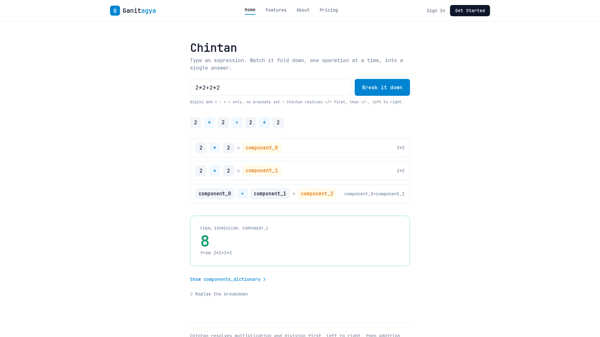

# Ganitagya 🧠

Platform to learn, discover and grow



# Problem 💌
Students struggle with math, lack of numerical understanding, Abstract ideas with weak foundation

## Components and features

1. Siddhi -> Adaptive quiz generator with loaded template files
2. Chintan -> simple numerical and visual disection tool for student to think with numbers
3. Mool -> Simple root graph for topic switching and student knowledge graph core reference Unit


## Usage 🚀

*works in linux 🐧* - Http way :)
```bash
git clone https://github.com/24f3004979/ganitagya.git
cd ganitagya
cd interface # get into interface folder
npm install # dependency installation command
npm run dev # starts the interface to load chintan unit
```

*check backend units cli versions*
After clonning and get into source folder , 🐍
```bash
uv sync  # Python manager | download it first :)
uv run server  # Starts  unicorn server at port 8000 if its free 
```
