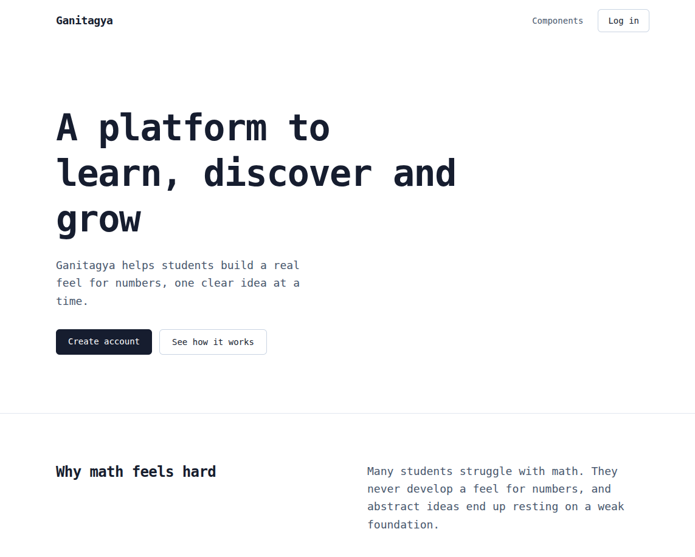

# Ganitagya

Platform to learn, discover and grow

# Problem 💌
Students struggle with math, lack of numerical understanding, Abstract ideas with weak foundation

🥳🎉
**Official Launch Date : 04/10/2026**
**Ganitagya is live at https://ganitagya-kznm.vercel.app/**

## Release Note 📁
1. Flagship siddhi primitive engine
2. Siddhi -> Mool graphing core --> Student knowledge modeling sync
3. End to end foundational student modeling system
4. Simple user management over web

## Components and features

1. Siddhi -> Adaptive quiz generator with loaded template files
2. Chintan -> simple numerical and visual disection tool for student to think with numbers
3. Mool -> Simple root graph for topic switching and student knowledge graph core reference Unit

